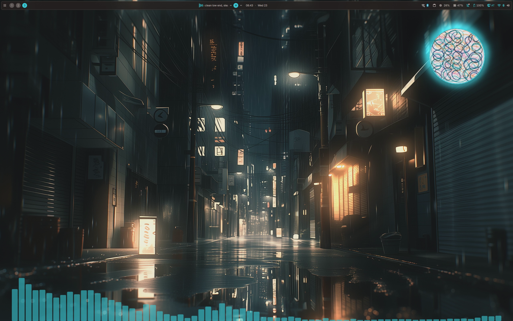

# AudioFX

[English](README.md) · [Deutsch](README.de.md) · **Español** · [Français](README.fr.md) · [Italiano](README.it.md) · [Português](README.pt.md) · [Русский](README.ru.md) · [日本語](README.ja.md) · [简体中文](README.zh_CN.md)

Un plugin para [DankMaterialShell](https://github.com/AvengeMedia/DankMaterialShell) con tres efectos de audio: un visualizador en un borde de la pantalla, un resplandor que hace latir con la música los puntos brillantes del fondo de pantalla y un disco redondo del reproductor para el escritorio.



Paso a paso con imágenes: [guía de instalación y configuración](docs/GUIDE.es.md).

## Visualizador

El visualizador se coloca a lo largo de un borde de la pantalla y deja libres el marco y la barra de DMS. Hay ocho estilos: onda rellena, onda como línea, onda reflejada, barras, barras reflejadas, barras colgantes, bloques y puntos. Se pueden ajustar el color, la opacidad, la profundidad, el número de bandas, la separación y la tasa de fotogramas.

cava solo se ejecuta mientras un reproductor MPRIS está sonando. Cuando la reproducción se detiene, el proceso se detiene, no solo se oculta. Un mosaico en el centro de control activa y desactiva el visualizador.

## Resplandor

El plugin busca zonas luminosas en el fondo de pantalla actual: píxeles saturados y brillantes en el tono más frecuente que destacan sobre su entorno. Lámparas, brasas, neón o lava funcionan bien. Las zonas grandes con luz uniforme, como un cielo, se descartan. El análisis se hace una vez por fondo de pantalla y se guarda en caché.

Luego las zonas se iluminan con la música. Hay cinco modos:

- Todo a la vez: cada zona sigue los graves y el volumen.
- Por tono: las zonas grandes siguen los graves, las medianas los medios y las pequeñas los agudos.
- Fluido: cada golpe de graves envía un frente de luz a lo largo de las zonas, empezando en el borde de la imagen.
- Destellos: cada zona parpadea a su propio ritmo.
- Espectro a lo ancho: notas graves a la izquierda, agudas a la derecha.

Sin reproducción, el resplandor puede quedar desactivado, brillar suavemente o respirar despacio. El color sale de la imagen o del acento de DMS.

## Disco del reproductor

Un widget de escritorio con la portada redonda de la pista actual. Gira durante la reproducción, muestra el progreso de la pista como un anillo y, al pasar el puntero, muestra anterior, reproducir y siguiente. Alrededor de la portada hay un visualizador: una onda como en el panel de DMS, barras en círculo o un anillo luminoso.

Si Pear Desktop (YouTube Music) se ejecuta con su servidor API activado, el disco carga la portada a 1200 px. MPRIS solo entrega 120 px en los reproductores basados en Chromium.

## Requisitos

- DankMaterialShell 1.6.1 o posterior
- cava
- Para el resplandor: python3 con numpy y Pillow

Yo lo uso en niri. El visualizador y el resplandor usan sus propias layer surfaces en la capa background. En niri, las superficies de esa capa se mueven con los espacios de trabajo, salvo que se coloquen en el backdrop. Añade estas reglas a la configuración de niri para que los dos se queden en su sitio:

```kdl
layer-rule {
    match namespace="^audiofx$"
    place-within-backdrop true
}
layer-rule {
    match namespace="^audiofx-glow$"
    place-within-backdrop true
}
```

El disco del reproductor es un widget de escritorio normal de DMS y se comporta como los demás widgets en tu compositor.

## Instalación

```sh
git clone https://github.com/21Rebel/dms-audiofx ~/.config/DankMaterialShell/plugins/AudioFx
dms ipc call plugins enable audioFx
```

El disco del reproductor se añade en Ajustes → Widgets del Escritorio → Añadir Widget de Escritorio → AudioFX.

## IPC

```sh
dms ipc call audiofx glow on|off|toggle
dms ipc call audiofx mode sync|bands|flow|sparkle|spectrum
dms ipc call audiofx set <key> <value>
dms ipc call audiofx get <key>
```

`set` y `get` usan las claves de los ajustes del plugin, por ejemplo `glowStrength` o `discForm`.

## Rendimiento

El resplandor cubre toda la pantalla, así que el compositor lo vuelve a dibujar en cada fotograma mientras suena música. La tasa de fotogramas del resplandor está en 30 por defecto y se puede bajar. Fuera de las zonas luminosas, el shader retorna de inmediato.

## Traducciones

La página de ajustes está disponible en alemán, español, francés, italiano, portugués, ruso, japonés y chino simplificado, y sigue el idioma configurado en DMS. Si alguna traducción suena mal, un pull request es bienvenido.

## Nota

Escribí este plugin con ayuda de Claude (Anthropic) y probé cada cambio en mi propio escritorio con niri. `AudioFxHalo.qml` se basa en `MediaBlobHalo.qml` de DankMaterialShell (MIT, Copyright (c) 2025 Avenge Media LLC).

## Licencia

MIT
