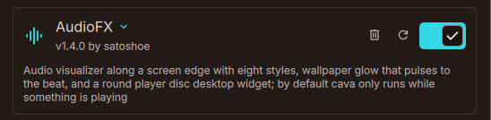
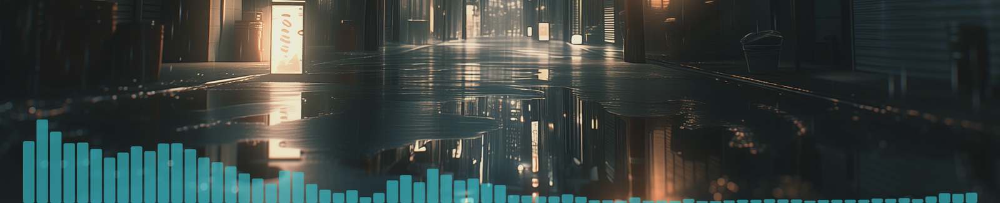
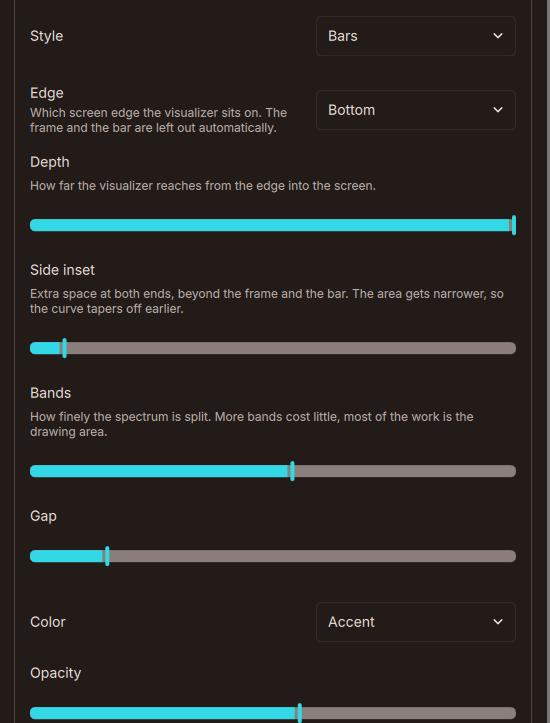
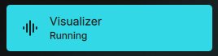
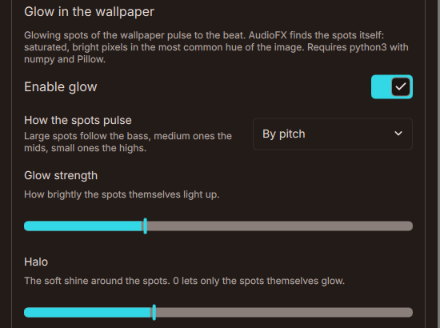
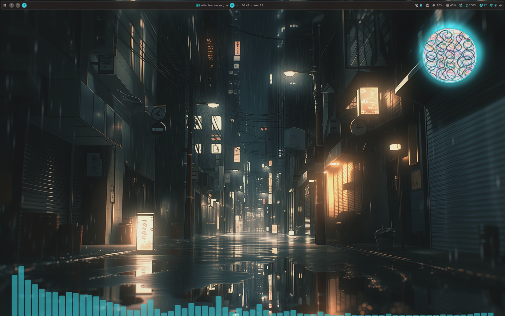
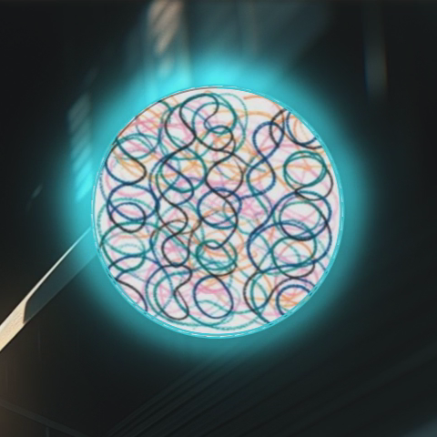

# AudioFX: paso a paso

[English](GUIDE.md) · [Deutsch](GUIDE.de.md) · **Español** · [Français](GUIDE.fr.md) · [Italiano](GUIDE.it.md) · [Português](GUIDE.pt.md) · [Русский](GUIDE.ru.md) · [日本語](GUIDE.ja.md) · [简体中文](GUIDE.zh_CN.md)

## 1. Instala lo necesario

AudioFX lee el audio a través de cava. El resplandor necesita además python3 con numpy y Pillow.

```sh
# Arch
sudo pacman -S cava python-numpy python-pillow
# Fedora
sudo dnf install cava python3-numpy python3-pillow
```

## 2. Instala y activa el complemento

Desde el registro de complementos:

```sh
dms plugins install audioFx
```

O clona el repositorio en tu carpeta de complementos de DMS:

```sh
git clone https://github.com/satoshoe-dev/dms-audiofx ~/.config/DankMaterialShell/plugins/AudioFx
```

Abre Ajustes → Complementos y activa AudioFX.



## 3. Solo niri: mantenlo en su sitio

En niri, las superficies de fondo se mueven con los espacios de trabajo, salvo que estén en el backdrop. Añade estas reglas a `~/.config/niri/config.kdl`:

```kdl
layer-rule {
    match namespace="^audiofx$"
    place-within-backdrop true
}
layer-rule {
    match namespace="^audiofx-glow$"
    place-within-backdrop true
}
```

Otros compositores no lo necesitan.

## 4. El visualizador

Reproduce algo de música. El visualizador aparece a lo largo del borde inferior.



Despliega AudioFX en la lista de complementos para cambiarlo. «Estilo» alterna entre ondas, barras, bloques y puntos. «Borde», «Profundidad» y «Margen lateral» lo colocan. «Color» y «Opacidad» definen el aspecto.



Si las barras parpadean en los pasajes suaves, sube «Calma». Si apenas se mueven, sube «Sensibilidad».

## 5. Activar y desactivar desde el centro de control

Abre el centro de control, pasa al modo de edición, haz clic en «Añadir widget» y elige AudioFX. Un clic en el mosaico activa o desactiva el visualizador.



## 6. El resplandor

Desplázate hasta «Resplandor en el fondo de pantalla» y activa «Activar resplandor». AudioFX busca zonas luminosas en tu fondo de pantalla. La primera vez tarda alrededor de un segundo y después queda en caché.



El resplandor funciona mejor con fondos de pantalla que tienen fuentes de luz pequeñas y brillantes: lámparas, neón, brasas, luces de ciudad. En un fondo sin esas zonas no se ilumina nada.

Elige cómo reaccionan las zonas en «Cómo laten las zonas»:

- Todo a la vez
- Por tono
- Fluido
- Destellos
- Espectro a lo ancho



Si se ilumina demasiado o demasiado poco, mueve «Umbral de detección». «Intensidad del resplandor» y «Halo» cambian el brillo.

## 7. El disco del reproductor

Abre Ajustes → Widgets del Escritorio → Añadir Widget de Escritorio y elige AudioFX. Arrastra el disco adonde quieras y cambia su tamaño.



Pasa el puntero sobre el disco para ver anterior, reproducir y siguiente. En «Disco del reproductor», dentro de los ajustes de AudioFX, elige el visualizador alrededor de la portada: una onda, barras en círculo o un anillo luminoso. «Teñir con el color de acento» tiñe la portada con el color de acento de DMS.

## 8. Comandos (opcional)

```sh
dms ipc call audiofx glow toggle
dms ipc call audiofx mode flow
dms ipc call audiofx set glowStrength 150
```
